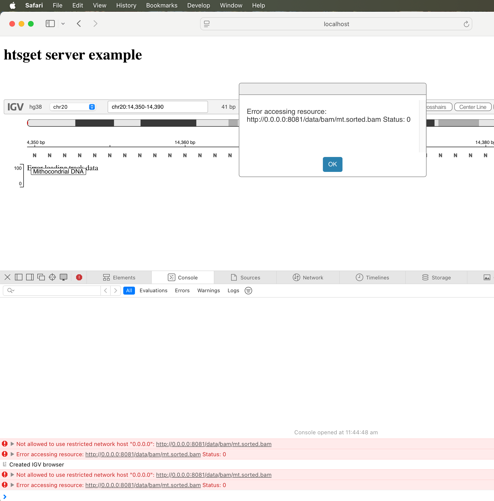
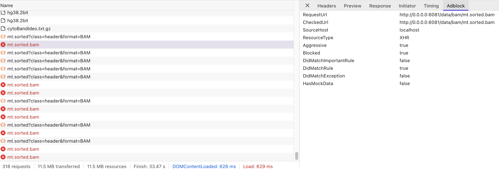
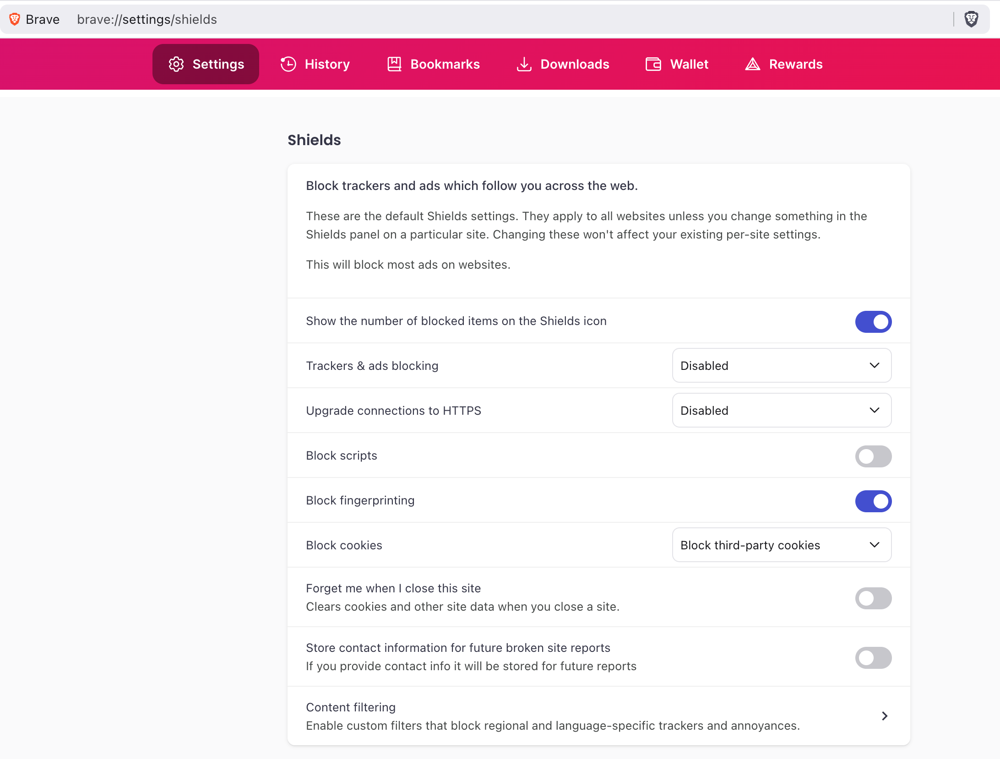

# Local development environment for IGV.js + htsget-rs

Production htsget-rs servers can be deployed to several cloud providers via [htsget-deploy], however a local
dev environment that bypasses CORS for convenience is very useful.

**WARNING:** Never use this environment in production, this is only meant for localhost-only debugging and development.

## Quickstart

Assuming you have `docker-(compose)` installed on your local machine, run this one time one liner:

```sh
git clone --recursive https://github.com/umccr/htsget-igv.js && cd igv.js && npm install && cd ..
```

Tilt up the docker containers:

```sh
docker compose up
```

Open the browser:

```sh
open http://localhost:8787/dev/htsget/htsget.html
```

## Browser config

Even if CORS is effectively disabled at the server level in this configuration's repo (see `compose.yml`'s **environment** directive for details),
some browsers will required a bit of settings tweaking, namely:

* **Firefox** will work right away :D
* Safari will currently not work due to restrictions around the use of [0.0.0.0][0.0.0.0-day].


* Brave will only work if its implicit Ad-blocking system is disabled.



[htsget-deploy]: https://github.com/umccr/htsget-deploy
[0.0.0.0-day]: https://www.oligo.security/blog/0-0-0-0-day-exploiting-localhost-apis-from-the-browser
