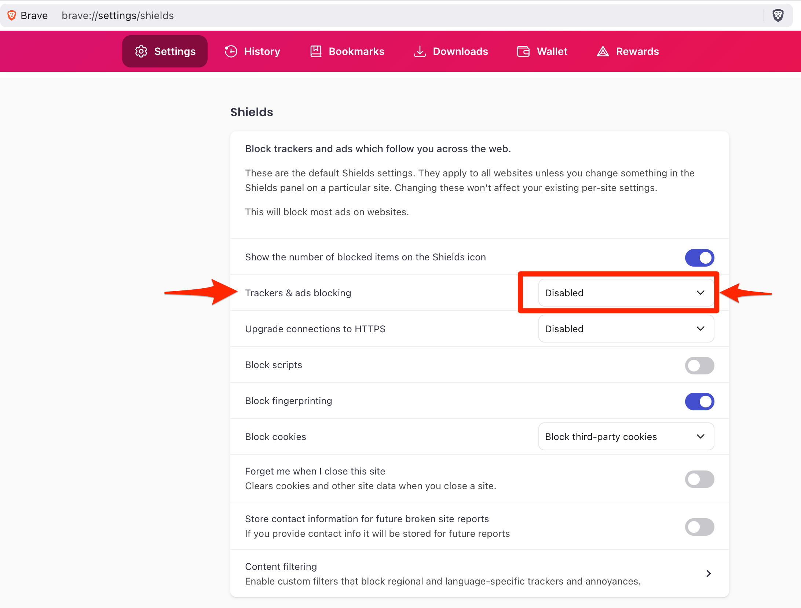

# Local development demo for htsget-rs and IGV.js

This project contains an example of htsget-rs and IGV.js, along with the htsget-rs authorization restrictions.

It implements the following architecture using local docker compose services:


In this repo, the components represent:
* **UI portal** - the igv-js service in the [compose.yml](compose.yml) which serves [htsget.html](igv.js/dev/htsget/htsget.html).
* **htsget-rs** - the htsget-rs service in the [compose.yml](compose.yml).
* **Authorization service** - the authorization service in [compose.yml](compose.yml).

## Quickstart

Run an npm install:

```sh
npm install
```

Tilt up the docker containers:

```sh
docker compose up
```

Add the appropriate JWT Bearer token (if you changed the default one):

Open the browser at:

```
http://localhost:8787/dev/htsget/htsget.html
```

If all goes well, you should see the following:


## Cloudflare workers

There is an alternative deployment that points igv.js to a publicly available htsget-rs instance deployed on cloudflare at:

```
http://localhost:8787/dev/htsget/htsget-workers.html
```

The htsget workers deployment is based on the [htsget-deploy] cloudflare deployment. Remote deployments can also be
managed from this repository, including on AWS.

## Browser config

Even if CORS is effectively disabled at the server level in this configuration's repo (see `compose.yml`'s **environment** directive for details), some browsers will require a bit of settings tweaking, namely:

### Firefox 

Will work right away :D

Please report if that's not the case for you?

### Safari

Will currently not work due to restrictions around the use of [0.0.0.0][0.0.0.0-day].


### Brave

Will only work if its implicit Ad-blocking is disabled on `localhost`:


<!--
Those screenshots disable all Ad-blocking, which is not great:



-->

[htsget-deploy]: https://github.com/umccr/htsget-deploy
[0.0.0.0-day]: https://www.oligo.security/blog/0-0-0-0-day-exploiting-localhost-apis-from-the-browser
